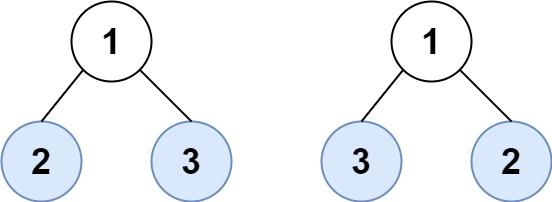

Consider all the leaves of a binary tree, from left to right order, the values of those leaves form a leaf value sequence.

For example, in the given tree above, the leaf value sequence is (6, 7, 4, 9, 8).

Two binary trees are considered leaf-similar if their leaf value sequence is the same.

Return true if and only if the two given trees with head nodes root1 and root2 are leaf-similar.

 

#### Example 1:

Input: root1 = [3,5,1,6,2,9,8,null,null,7,4], root2 = [3,5,1,6,7,4,2,null,null,null,null,null,null,9,8]
Output: true
#### Example 2:

Input: root1 = [1,2,3], root2 = [1,3,2]
Output: false
 

#### Constraints:

- The number of nodes in each tree will be in the range [1, 200].
- Both of the given trees will have values in the range [0, 200].